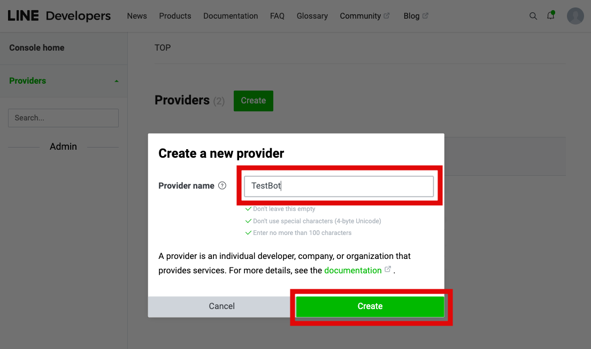
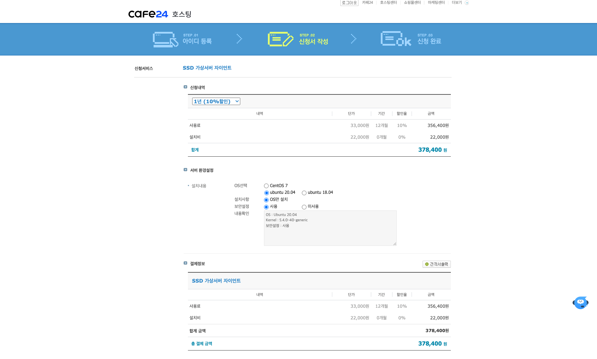
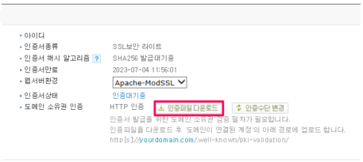

# LineBot 설치 😀
## 💡 라인봇(Line-Bot)설치하는 과정을 단계별로 정리하였다. 
## 목차
> ## 1. Line 개발자 등록 및 설정
> ## 2. Cafe24 도메인 및 인증서 신청
> ## 3. Cafe24 서버 신청
> ## 4. Docker 구성
> ## 5. docker 설치 및 실행
> ## 6. 인증서 소유권 인증 
> ## 7. 최종 마무리

---

</br>

## 1. Line 개발자 등록 및 설정
- '비즈니스 계정'으로 생성후 로그인 진행

- 'Create'버튼 클릭

- 서비스 이름을 넣고 Provider 생성

- Messaging API channel 생성

- 화면에서 'Channel Secret' 복사

- 화면에서 'Channel access token (long-lived)'에서 issue클릭

- 'Channel access token' 복사

- Webhook settings에서 이미 cafe24에서 만들어 놓은 https://www.xxxx.co.kr를 넣고 update 클릭.
- 반드시 https로 넣어야 함

- 'Use webhook' 버튼을 on으로 변경

- 아래와 같이 표시 되면 연동 완료

- 위에서 복사한 'Channel Secret', 'Channel access token' 두개를 Dockerfile.linebot파일에 넣는다.


## 2. Cafe24 도메인 및 인증서 신청
- 도메인 신청


    - 원하는 도메인을 검색하여 도메인을 구입
- 인증서 신청

- 가장 저렴한 인증서로 신청한다.

- 인증서 신청시 '도메인 소유권 인증'을 진행하게 되는데 'HTTP인증'을 추천한다.

    - 'HTTP인증'은 가장 처리가 빠르다는 장점이 있다.
    - 'HTTP인증'인증을 하기 위해서는 서버가 구축이 되어있어야 한다.

## 3. Cafe24 서버 신청
- 가상서버호스팅을 신청한다.

- 원하는 타입의 서비스를 신청한다.



    - 사용 기간은 자유롭게 선택한다.
    - OS는 Ubuntu 20.04선택 후 결제한다.

## 4. Docker 구성
- 이미 파일을 구성해 놓은 상태이므로 이 부분은 건너뛰어도 된다.
- docker-compose.yml 파일에 두개 서버를 구성한다.
    - nginx port : 80(http), 443(https)
    - ubuntu port : 8000(FastAPI) 
- 각 서버 Dockerfile에 필요한 부분을 설정한다.
    - nginx용 Dockerfile.nginx
        - nginx 및 인증서 파일 설정
    - ubuntu용 Dockerfile.linebot
        - line-bot-sdk-python 라이브러리 설치

## 5. docker 설치 및 실행
- 이미 구입한 '가상서버호스팅'에 접속한다.
    ```
        $ ssh root@xxx.xxx.xxx.xxx
    ```
- git을 설치한다.
    ```
        $ sudo apt update
        $ sudo apt-get install git -y
    ``` 
- docker, docker-compose를 설치힌다.
    ```
        $ sudo apt-get install -y ca-certificates curl software-properties-common apt-transport-https gnupg lsb-release
        $ curl -fsSL https://download.docker.com/linux/ubuntu/gpg | sudo gpg --dearmor -o /usr/share/keyrings/docker-archive-keyring.gpg
        $ echo "deb [arch=amd64 signed-by=/usr/share/keyrings/docker-archive-keyring.gpg] https://download.docker.com/linux/ubuntu $(lsb_release -cs) stable" | sudo tee /etc/apt/sources.list.d/docker.list > /dev/null
        $ sudo apt update
        $ sudo apt-get install docker-ce docker-ce-cli containerd.io
    ```
- source code 다운로드
    ```
        $ git clone https://github.com/leeyonghe/LineBot.git
    ```
- Dockerfile.nginx에서 '처음실행' 부분 먼저 진행, '두번째 실행' 주석 처리

- docker 실행 명령어
    ```
        $ cd LineBot
        $ docker-compose up -d 
    ```

## 6. 인증서 소유권 인증 
- Cafe24에서 '나의서비스관리' > '인증서관리' > '인증서받기'로 이동

- 위 이미지에서 '인증파일 다운로드' 클릭후 아래 txt파일 다운로드

- 해당 파일을 local(본인컴퓨터)에서 '가상서버'로 이동시키고 다시 이 파일을 nginx로 이동
    - local(본인컴퓨터)에서 '가상서버'로 이동
        - scp xxx.txt root@xxx.xxx.xxx.xxx:/root
    - '가상서버'내부에서 docker nginx내부로 txt 파일 이동
        - docker cp xxx.txt nginx:/usr/share/nginx/html/.well-known/pki-validation
- 위와 같이 설정하고 설정한 도메인으로 제대로 파일이 보이는지 테스트
    - http://www.xxxx.co.kr/.well-known/pki-validation
    - 올려놓은 파일이 브라우저에서 보이면 세팅 완료
- 1시간 정도 기다린 후 (1시간이 넘을 수도 있음.)
- 인증이 완료되면 아래와 같이 인증서 4개를 받을 수 있다.

    - 인증서 변환
        - local(본인컴퓨터)에서 run_ssl.sh 명령어 실행
        - 만약 윈도우 환경이라면 WSL(Window Subsystem for Linux)를 설치후 실행

## 7. 최종 마무리
- '가상서버호스팅'에 접속하다.
    ```
        $ ssh root@xxx.xxx.xxx.xxx
    ```
- Dockerfile.nginx에서 '처음실행' 부분 주석처리, '두번째 실행' 주석 해재
    
- 아래 명령어를 실행
    ```
        $ cd LineBot
        $ docker-compose build
        $ docker-compose up -d 
    ```